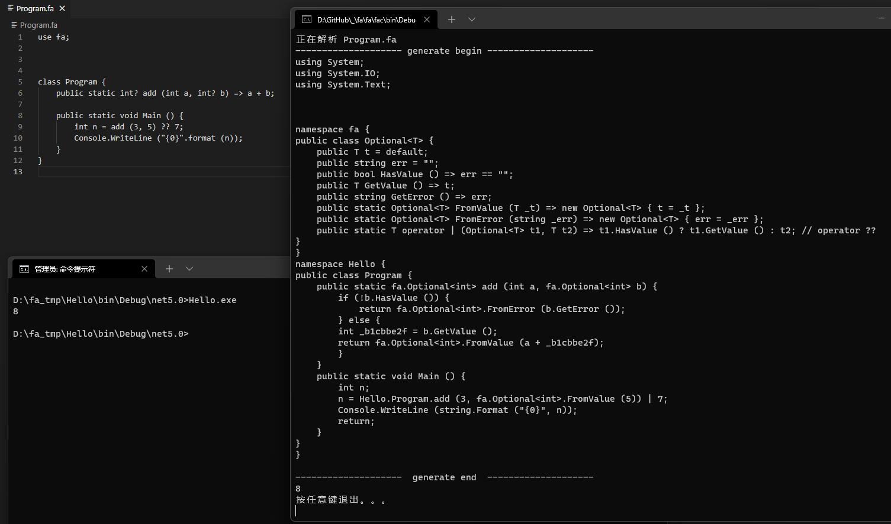
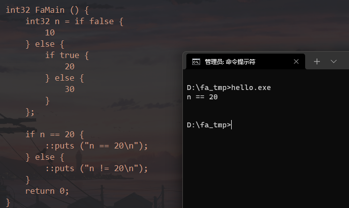
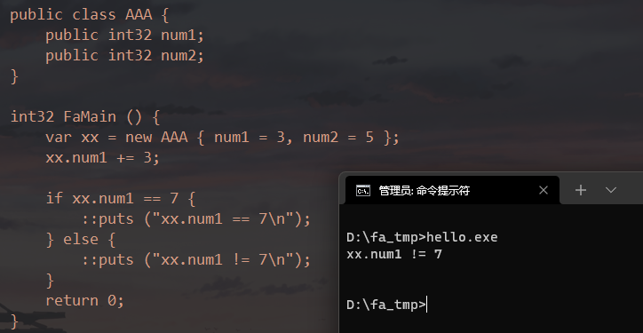
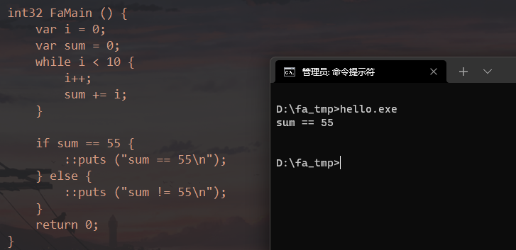
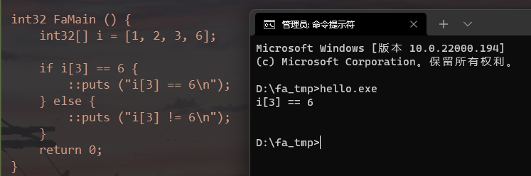

# fa

fa语言是一款按照我个人最主观的看法，设计出的一款最不容易误解、最简单的编程语言。目前处于还不完善阶段，无法测试及使用。

qq交流群：1018390466 欢迎一起讨论语法/实现/轮子

此仓库主要包含：

- fa 语言编译器（开发中）
- [fa语言草案（暂不完善）](./draft/README.md)
- [~~fa语言草案（废弃）~~](./draft.md)
- [fa语言用户手册（暂不完善）](./manual.md)

## 目标

- 极简（编译器控制变量位于栈上、堆上、是否引用计数、是否原子化等）
- 安全（船新错误处理方案，确保能编译的代码无异常。ps:系统异常除外）
- 元编程（变量加上 "@" 前缀即代表编译期计算）
- 高性能（llvm ir后端输出，原生指令运行，simd优化）
- 原生状态机（语言自带的状态机实现方案）
- 所有权及释放（通通编译器处理）
- 强制开发范式（比如强制实现DDD模型）

<!--- 提前编译多种Native代码与SIMD（比如x86-64编译x86、amd64、MMX、SSE、AVX等），然后分别压缩-->
<!--- 编译出的程序运行后检查当前平台支持的最快速的SIMD指令集，解压指令集代码，并执行-->
<!--	+ 在加速效果非常明显的位置编译SIMD代码-->

## 进度

- ~~基于C++语言，Antlr前端，llvm binding API后端，实现初版fa语言编译器（废弃）~~
- 基于C#语言，Antlr前端，C#后端，实现初版fa语言编译器
	+ Hello World （√）
	+ 可空类型（√）
- 基于fa语言，fa前端，llvm ir后端，实现自举fa语言编译器（开发中）
	+ 尝试编写自举代码，找出编译器现有问题（当前进度）

## 示例

第一版编译为C#，下图为生成的等价C#代码。由图可见，fa语言两大特性：

1. 可空类型（带问号）可以存储值或者错误（类似null，但带了错误原因）
2. 函数返回类型为可空类型时，遇到错误则直接返回错误内容



这种语法好处：

- 提高错误处理的性能（异常状态切换很耗cpu资源，fa语言本身无异常）
- 调用者能看出来代码是否安全（其他语言无法避免函数抛异常）
- 极大简化写法（不像go每调用一个函数就判断一下err）

<!--## 当前进度

- [ ] 基本语法
	+ [x] 表达式
	+ [x] 类、对象、继承（暂不完全）
	+ [ ] 异步
	+ [ ] linq
- [ ] 编译系统
	+ [x] 支持Windows x86平台
	+ [ ] 支持交叉编译
	+ [ ] 支持Windows、Linux、Mac平台
- [ ] 速度、体积优化
	+ [ ] 并发优化
	+ [ ] SIMD支持
		* [ ] 计划支持：SSE4.2、AVX、AVX2、AVX512、neon
	+ [ ] 可执行代码压缩（待定）
- [ ] ...

## 基本语法特性
- 构造函数允许返回null，代表失败
- meta变量编译时求值
- 接近C#的语法
- 纯stackful
- 进程间调用
  - 创建子进程时，能共享对象（通过共享段或共享内存实现）
- 浮点数==比较为指定精度比较，精确比较使用===
- 文件夹代表命名空间
- 类变量没有赋予初值时，强制要求声明对象时赋初值
- 不区分栈变量、堆变量与引用变量，无需手工使用智能指针
- 函数自动微分

## 示例代码

```fa
// 声明类实例
public class TestClass {
	// 字段
	public string Value1;
	public string Value2 = "hello";
	public string Value3 { get; set; }
	public string Value4 { get; set; } = "hello";

	// 可以被赋予哪些类型的值
	public static TestClass From (int32 _n) {}
	public static TestClass From (double _n) {}
	public static TestClass From (string _s) {}

	// 定义函数
	public string func () {}
}

// 实例化类型
var tc1 = new TestClass { Value1 = "a", Value3 = "c" }; // 必填参数
var tc2 = new TestClass { Value1 = "a", Value2 = "b", Value3 = "c", Value4 = "d" }; // 包括可选参数
```

### 运行效果

if表达式：



---

类成员访问：



---

循环：



---

数组：


-->


<!--
编写LLVM Pass模块知识点梳理√
https://blog.csdn.net/u010940020/article/details/99721684


七妹要奈斯的LLVM专栏√
https://blog.csdn.net/qq_42570601/category_10200372.html


intel的SPMD优化方案
https://github.com/ispc/ispc


https://zhuanlan.zhihu.com/p/25959684
前言（就是本篇）
考不上三本也能给自己心爱的语言加上Coroutine（一） - 知乎专栏
考不上三本也能给自己心爱的语言加上Coroutine（二） - 知乎专栏
考不上三本也能给自己心爱的语言加上Coroutine（三） - 知乎专栏
考不上三本也能给自己心爱的语言加上Coroutine（四） - 知乎专栏
考不上三本也会实现数据绑定（一） - 知乎专栏
考不上三本也会实现数据绑定（二） - 知乎专栏
考不上三本也会实现数据绑定（三） （作者： @余生梦 ）
考不上三本也能实现C++编译器——前言
考不上三本也能懂系列——处理声明（一）
考不上三本也能懂系列——处理声明（二）
考不上三本也能懂系列——处理声明（三）（新！）
考不上三本也能懂系列——实现C++类型系统（一）
考不上三本也能懂系列——实现C++类型系统（二）
考不上三本也能懂系列——什么是C++的argument-dependent lookup


SIMD简介
https://zhuanlan.zhihu.com/p/55327037


LLVM新建全局变量
https://www.cnblogs.com/jourluohua/p/10813824.html


IR API(四)——操作IR的字符串、全局变量、全局常量及数组
https://blog.csdn.net/qq_42570601/article/details/108007986


创建结构体
https://llvm.org/doxygen/classllvm_1_1StructType.html#a7cf5280be35cd0c973f40c7d87a11acd


可微编程-自上而下的产品形态 5 Swift中的自动微分
https://zhuanlan.zhihu.com/p/133721083


LLVM新建全局变量
https://www.cnblogs.com/jourluohua/p/10813824.html


C++ IRBuilder::CreateStructGEP方法代码示例（有点水）
https://vimsky.com/examples/detail/cpp-ex---IRBuilder-CreateStructGEP-method.html


LLVM Language Reference Manual
https://llvm.org/docs/LangRef.html


//// MT
//@lib "libucrt.lib";
//@lib "libcmt.lib";
////@lib "libvcruntime.lib";

// MD
@lib "ucrt.lib";
@lib "msvcrt.lib";
//@lib "vcruntime.lib";

//@lib "kernel32.lib" "user32.lib" "gdi32.lib" "winspool.lib" "comdlg32.lib" "ole32.lib";
//@lib "advapi32.lib" "shell32.lib" "oleaut32.lib" "uuid.lib" "odbc32.lib" "odbccp32.lib";

-->
